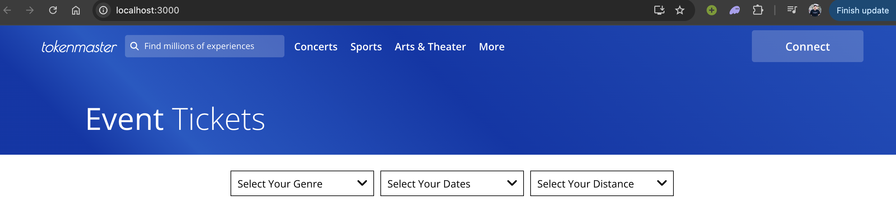

# Web 3.0 Ticketmaster - Decentralized NFT Ticket Marketplace

A full-stack decentralized application (DApp) built on Ethereum for secure event ticketing. Organizers create events and mint unique **ERC-721 NFT tickets**, while users buy tickets directly or resell them on a peer-to-peer secondary marketplace. This eliminates scalping, ensures ticket authenticity, and provides transparent ownership.

This project demonstrates expertise in **Solidity smart contracts**, **Hardhat development**, **Ethers.js integration**, and **React frontend** — perfectly aligned with modern blockchain development.



<grok-card data-id="81d17b" data-type="image_card"  data-arg-size="LARGE" ></grok-card>


<grok-card data-id="07da26" data-type="image_card"  data-arg-size="LARGE" ></grok-card>


<grok-card data-id="635a0c" data-type="image_card"  data-arg-size="LARGE" ></grok-card>


<grok-card data-id="ca0218" data-type="image_card"  data-arg-size="LARGE" ></grok-card>


## Key Features
- **Event Creation** — Organizers define events (name, date, price, quantity) and mint limited NFT tickets.
- **Primary Ticket Sales** — Users purchase tickets directly from organizers.
- **Secondary Marketplace** — Ticket holders resell NFTs securely with on-chain ownership transfer.
- **Anti-Scalping Protection** — Fixed pricing and controlled resales.
- **MetaMask Wallet Integration** — Connect wallet, sign transactions, and manage tickets seamlessly.
- **Responsive UI** — Modern, user-friendly interface for browsing, minting, and trading.


<grok-card data-id="372e5b" data-type="image_card"  data-arg-size="LARGE" ></grok-card>


<grok-card data-id="3969f8" data-type="image_card"  data-arg-size="LARGE" ></grok-card>


<grok-card data-id="71da27" data-type="image_card"  data-arg-size="LARGE" ></grok-card>


<grok-card data-id="94c0ba" data-type="image_card"  data-arg-size="LARGE" ></grok-card>


<grok-card data-id="3e7841" data-type="image_card"  data-arg-size="LARGE" ></grok-card>


<grok-card data-id="8ba774" data-type="image_card"  data-arg-size="LARGE" ></grok-card>


<grok-card data-id="db48c4" data-type="image_card"  data-arg-size="LARGE" ></grok-card>


<grok-card data-id="312308" data-type="image_card"  data-arg-size="LARGE" ></grok-card>


## Technology Stack
- **Smart Contracts**: Solidity, OpenZeppelin (ERC-721, Ownable, ReentrancyGuard)
- **Development & Testing**: Hardhat
- **Frontend**: React.js, Ethers.js
- **Blockchain**: Ethereum (local Hardhat network, compatible with testnets/mainnet)


<grok-card data-id="2472ec" data-type="image_card"  data-arg-size="LARGE" ></grok-card>


<grok-card data-id="fa9ea1" data-type="image_card"  data-arg-size="LARGE" ></grok-card>


## How to Run Locally
1. Clone the repository:
   ```bash
   git clone https://github.com/Shubhammore71/Web-3.0-Ticketmaster.git
   cd Web-3.0-Ticketmaster
